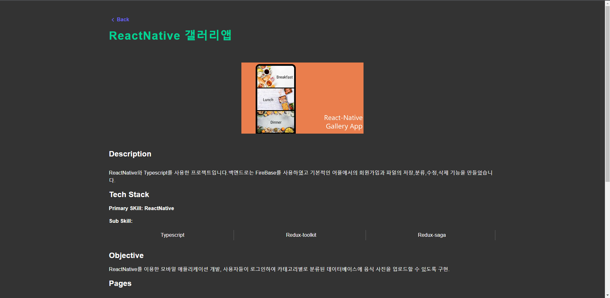

<h1 align="center">김선규 포트폴리오</h3>

 

    NextJS 포트폴리오
     
     
    <a href="https://sunguekim-portfolio.vercel.app/">View Demo</a>
  

  
Home Section

  

  
Dark Mode

  

 
 

  
Experience Section

  

 

  
Projects Section

  

  

 

### Built With

* [Next JS](https://nextjs.org/)
* [Material UI](https://material-ui.com/)
* [Framer Motion](https://www.framer.com/motion/)